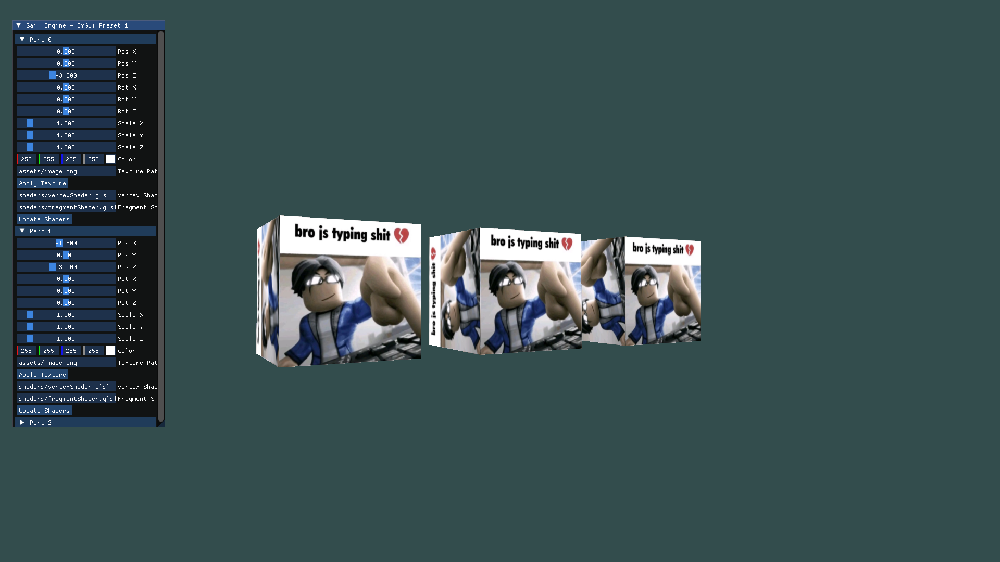

# preview:


with the new version, it has a lighting, but it's only limited with one since i'm at the beginning of it. not sure
how to calculate multiple.

# how to run:

```
mkdir build
cd build
cmake -B .
cmake --build .
./program.exe
```

## about

it's an experimental engine that I work on. it's mostly a learning project, you could see some trash code here and there, but I try to keep it clean.
i'm using msys2's mingw, and installed the glm/glfw packages from there

## controls

ESC: Close application
X: cursor lock toggle
F11: toggle fullscreen
WASD: move
Mouse: look around
Scroll: fov


## some fun facts:
- i dont have an asset loader yet, so instead, cmake copies all assets to the build folder